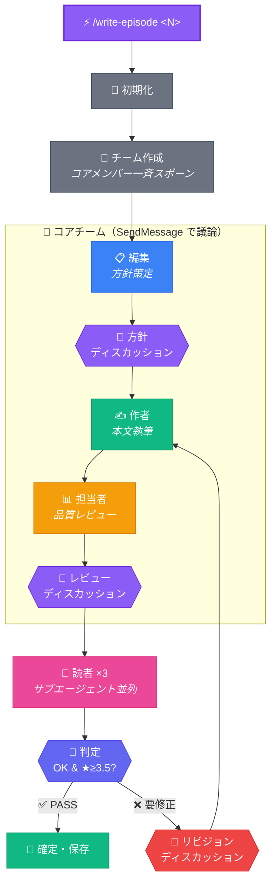

<div align="center">

# 📖 灰色の魔導書と忘却の王国

### ─ グリモワール・オブ・アッシュ ─

<br>

**🤖 AI マルチエージェントが紡ぐ異世界ファンタジー Web 小説**

<br>


<br>

---

*記憶を失い異世界で目覚めた少年が、手元に残された一冊の魔導書を頼りに、*
*記憶に傷を負う仲間たちと忘れ去られた王国の真実に迫る。*

---

</div>

<br>

## 🌍 世界観

> **「忘れること」と「覚えていること」の価値** ── それがこの物語のテーマ。

世界「**エルデシア**」では、魔法は **記憶** を燃料として行使される。強力な術ほど、術者の大切な記憶が灰となって消える。

かつて栄華を誇った「**ヴェルディア王国**」は、300年前の大戦で王族が禁呪を発動し、国民の記憶もろとも歴史から消え去った ── 通称「**忘却の王国**」。

主人公 **九条 蓮** は、この世界に呼ばれた真の理由と、灰のグリモワールに秘められた世界の真実に迫っていく。

<br>

## 🤖 マルチエージェント・アーキテクチャ

このプロジェクトの核心は、**4種のAIエージェントが対話的に協力**して小説を自動執筆する仕組みです。



<br>

### エージェント一覧

<table>
<tr>
<td align="center" width="25%">

**📋 編集**
<br>
`agents/editor.md`
<br>
`チームメンバー`
<br><br>
全体プロットと設定を踏まえ
<br>
各話の**創作方針**を決定

</td>
<td align="center" width="25%">

**✍️ 作者**
<br>
`agents/author.md`
<br>
`チームメンバー`
<br><br>
編集の方針に従い
<br>
**本文を執筆・改稿**

</td>
<td align="center" width="25%">

**📊 担当者**
<br>
`agents/manager.md`
<br>
`チームメンバー`
<br><br>
ドラフトの**品質評価**と
<br>
合否判定を実施

</td>
<td align="center" width="25%">

**👥 読者 ×3**
<br>
`agents/readers/`
<br>
`サブエージェント`
<br><br>
3ペルソナ視点で
<br>
**感想と★評価**を提供

</td>
</tr>
</table>

<br>

### 読者ペルソナ

| ペルソナ | 年齢 | 視点 |
|:---:|:---:|:---|
| 🧑 **ユウキ** | 17歳 男性 | 同世代の感覚で没入感・共感度を評価 |
| 👩 **サキ** | 28歳 女性 | 物語構成・キャラクター描写の深みを分析 |
| 👨 **タツヤ** | 35歳 ベテラン | 豊富な読書経験から設定・展開の独自性を評価 |

<br>

## 📂 プロジェクト構成

```
Agentic_Novel/
│
├── 📄 CLAUDE.md                     # システム設定・ルール
├── 📄 README.md                     # このファイル
│
├── 🤖 agents/                       # エージェント定義
│   ├── editor.md                    #   編集エージェント
│   ├── author.md                    #   作者エージェント
│   ├── manager.md                   #   担当者エージェント
│   └── readers/                     #   読者エージェント
│       ├── reader-young-male.md     #     ユウキ（17歳）
│       ├── reader-adult-female.md   #     サキ（28歳）
│       └── reader-veteran.md        #     タツヤ（35歳）
│
├── 📚 story/                        # 共有設定（全エージェント参照）
│   ├── premise.md                   #   作品コンセプト
│   ├── setting.md                   #   世界観設定
│   ├── characters.md                #   登場人物
│   ├── plot-outline.md              #   全体プロット
│   ├── episode-summaries.md         #   各話あらすじ蓄積
│   ├── writing-guide.md             #   文体・記法ガイド
│   ├── handover-notes.md            #   次話への申し送り
│   └── quality-log.md               #   品質トレンド記録
│
├── 📖 episodes/                     # 確定エピソード
│   ├── 01_灰色の目覚め.txt
│   ├── 02_記憶という代償.txt
│   ├── ...
│   └── 12_追手.txt
│
├── 🔧 workspace/                    # エージェント間の作業領域
│   ├── current-direction.md         #   編集の方針
│   ├── current-draft.txt            #   作者のドラフト
│   ├── manager-review.md            #   担当者レビュー
│   ├── reader-feedback-*.md         #   読者フィードバック
│   ├── consolidated-feedback.md     #   統合フィードバック
│   ├── revision-log.md             #   リビジョン履歴
│   └── discussion-log.md           #   ディスカッション記録
│
└── 📦 archive/                      # 過去ドラフト保存
    └── episode-XX/
```

<br>

## 🚀 使い方

### エピソードを執筆する

```bash
# Claude Code で実行
/write-episode <エピソード番号>
```

> **1コマンドで完結！** 方針策定 → 執筆 → レビュー → フィードバック → 改稿 → 確定 が全自動で実行されます。

### 主なパラメータ

| パラメータ | デフォルト | 説明 |
|:---|:---:|:---|
| `--max-revisions=N` | `3` | 最大リビジョン回数 |
| エピソード文字数 | `2000〜3000` | 各エピソードの目安文字数 |
| 読者平均★ | `≥ 3.5` | 確定に必要な最低評価 |

<br>

## 📊 連載進捗

```mermaid
gantt
    title 全20話 連載進捗
    dateFormat X
    axisFormat %s話

    section 第一幕 — 邂逅
    灰色の目覚め           :done, ep1, 1, 2
    記憶という代償          :done, ep2, 2, 3
    剣と眼帯の男           :done, ep3, 3, 4

    section 第二幕 前半 — 探索
    クレセント港の影        :done, ep4, 4, 5
    灰の回廊              :done, ep5, 5, 6
    記憶管理局             :done, ep6, 6, 7

    section 第二幕 後半 — 試練
    忘れられた街           :done, ep7, 7, 8
    霧の中の記憶           :done, ep8, 8, 9
    忘却の王国の門          :done, ep9, 9, 10
    王の残響              :done, ep10, 10, 11
    選択の重み             :done, ep11, 11, 12
    追手                  :done, ep12, 12, 13
    Episode 13            :active, ep13, 13, 14

    section 第三幕 — 覚醒と決断
    Episode 14            :ep14, 14, 15
    Episode 15            :ep15, 15, 16
    Episode 16            :ep16, 16, 17
    Episode 17            :ep17, 17, 18
    Episode 18            :ep18, 18, 19
    Episode 19            :ep19, 19, 20
    Episode 20            :ep20, 20, 21
```



<br>

## 💡 設計思想

<table>
<tr>
<td width="50%">

### 🎭 なぜマルチエージェントか

従来の AI 執筆は一つの LLM がすべてを担っていました。本プロジェクトでは **役割分担** と **相互レビュー** により：

- 📋 **方針のブレを防止**（編集エージェント）
- ✍️ **執筆に集中**（作者エージェント）
- 📊 **客観的品質管理**（担当者エージェント）
- 👥 **多角的評価**（読者エージェント）
- 💬 **創発的議論**（チームディスカッション）

を実現しています。

</td>
<td width="50%">

### 🔄 自動改稿ループ

品質基準を満たすまで自動で改稿を繰り返す仕組みにより：

- ⚡ 人間の介入なしに品質向上
- 📈 読者評価によるフィードバック駆動
- 🛡️ 最大リビジョン回数による安全弁
- 📝 全ドラフト履歴を `archive/` に保存

を保証しています。

</td>
</tr>
</table>

<br>

## 📜 ルール

> [!IMPORTANT]
> - コアメンバー間の通信は **SendMessage** による直接メッセージで行う
> - 成果物（方針・ドラフト・レビュー等）は `workspace/` 内のファイルとして出力する
> - ディスカッションの知見は `workspace/discussion-log.md` に記録する
> - 各エージェントは `agents/*.md` に定義された役割に忠実に従う
> - `story/` 内のファイルは全エージェントが参照する共有設定
> - 読者フィードバックは **サブエージェント並列実行** で効率化する

<br>

---

<div align="center">

**Powered by [Claude Code](https://claude.ai/) × Multi-Agent Architecture**

<sub>🔮 記憶を灯して、物語を紡ぐ ──</sub>

</div>
